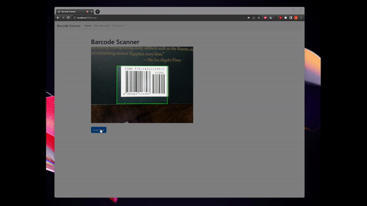
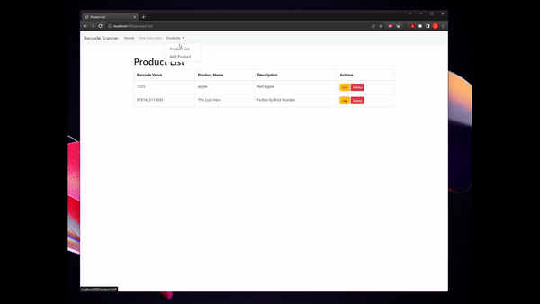
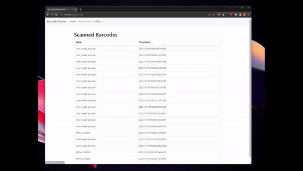

# Barcode Scanner Project

## Description

This project provides a simple web application for scanning barcodes using a webcam. Users can manually enter product details associated with a barcode, view the list of products, and manage them (edit/delete).

## Features

### Capture images via webcam and view barcode list

### Manually enter product details associated with a barcode

### View, edit, and delete products

## Setup and Installation

1. Ensure you have Java and Maven installed on your machine.
2. Clone the repository: `git clone https://github.com/JosephDeleon-1/barcode-inventory-new.git`.
3. Navigate to the project directory: `cd barcodescanner`.
4. Install dependencies: `mvn install`.
5. Run the application: `mvn spring-boot:run`.

## Usage

1. Visit `http://localhost:8080/scan` to access the barcode scanning page.
2. Use the provided features to manage products and barcodes.

## Contributing

Pull requests are welcome. Please ensure to update tests as appropriate.

## License

MIT
